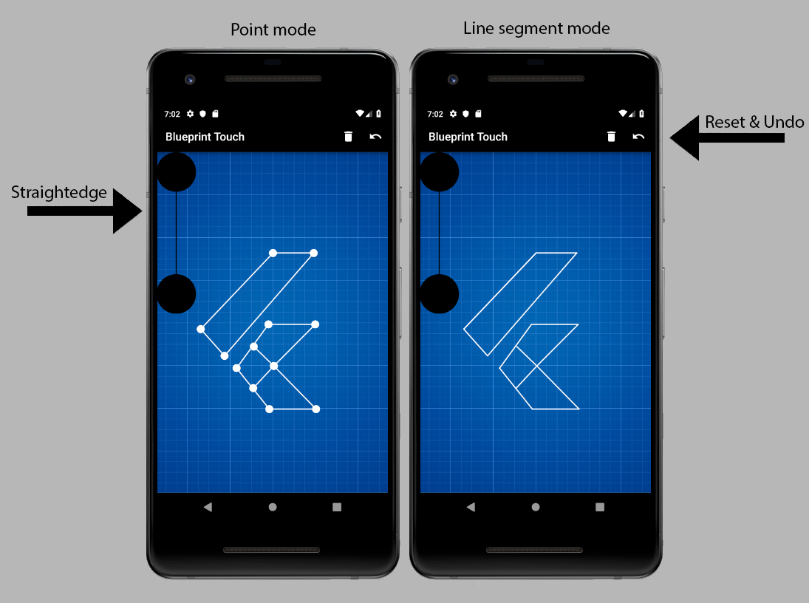

# Blueprint Touch

Hey everyone. I'm Remixie and this is my entry for the Flutter Create contest. It's a technical drawing app that's optimized for touchscreen devices.
***

## Tech Specs
- Dart file size: 5,117 bytes
- License: Apache License 2.0
- Target platforms: Android **and** iOS
- Dart pub packages: [scoped_model 1.0.1](https://pub.dartlang.org/packages/scoped_model)
- Device orientation support: Portrait
- Devices used during development:
  - iPhone 6 (Simulator on macOS)
  - Pixel 2 API 28 / Android Pie (Virtual Device in Android Studio)
  - Pixel 3 with Android Pie
***

## Visual Layout

***

## Setup
1. Make a new Flutter Project (Flutter Application) in Android Studio
2. Replace the generated `main.dart` file with the one provided in the zip file
3. Replace the generated `pubspec.yaml` with the one provided in the zip file
4. Make an `assets` directory in the same directory as `lib`
5. Move `Blueprint-Paper-by-RetinaShots.png` to the `assets` directory
6. Click `packages get` and verify that nothing is underlined with red in `main.dart` upon saving it
7. Run `flutter run --release -d <device id>` on the Flutter project directory but not before replacing `<device id>`
***

## Usage Guide

- To `make a point`, tap somewhere on the blueprint paper area
- To `make a line segment`, tap somewhere else on the same area
- To `remove your last point`, click the undo button
- To `reuse a point`, tap on it
- To `reset the area`, click the trashcan button
- To `move the straightedge`, drag either or both of its black dots
- `Tap on the straightedge` to make points and/or line segments at more precise coordinates

**Note:** If you tap on the straightedge at around the same coordinates where an existing point is located, your tap will be registered as a reuse, **not** as a new point aligned with the straightedge.
***

## Execution Notes
In terms of UI/UX, tons of details were taken into account. These are some of them:
- The undo button is intentionally placed more to the right for *`faster editing`*
- *`Contrast is maximized`* through the use of black and white on the paper area
- The black dots can be tucked into a corner of the screen to *`reduce visual clutter`*
- Existing points appear every other tap so an end-user can *`quickly see line segments`*
- The AppBar background color is set to black so it can blend in with a touchscreen's upper bezel.
- The straightedge has a *`hidden hitbox area`* that detects when a user taps within 35 pixels of it
- Line segments are drawn with **StrokeCap.round** so that *`corners are smooth and notch-less`*
- The blueprint background doubles as grid paper. This facilitates the *`exact positioning`* of the straightedge, points and line segments
***

## Documentation
The `main()` function runs `MyApp`.  
`MyApp` is a StatelessWidget that builds a MaterialApp whose home property is set to `DrawPage`.  
`DrawPage` is a StatefulWidget that builds `ScopedModel<MathModel>` and returns a `Scaffold`.  

The `Scaffold` returns a Stack widget whose children are a Container and another Stack. The Container has has a Listener that detects when a user taps on it and calls `MathModel.moveSEdge()` and `Painter`. Its background is set to the public domain grid image asset provided by [Retina Shots](http://ipad.retinashots.com/). The child Stack returns two instances of `DragDot`.

### `DragDot`
This is a Stateful widget that creates a `DragDotState`.
- Fields:
  - `int i`
    - This is the index of the DragDot instance
  - `BuildContext bc`
    - This references the BuildContext from `DrawPage`
  
### `DragDotState`
This builds a Container that has a GestureDetector child.  
This GestureDetector calls `MathModel.moveSEdge()` so this dot moves properly as an end-user drags it around.
- Fields:
  - `var m`
    - This references the `MathModel` instance from `DrawPage`
   
### `MathModel`
This handles the model logic.
- Fields:
  - `List<Offset> p`
    - This list contains all user-defined points
  - `static get hds`
    - This is a constant double value that defines:
      - The radi of the black dots (scaled at 1x `hds`)
      - The radi of user-defined points (scaled at 1/5x `hds`)
      - The max tolerance in distance from the straight edge until point placement becomes freehanded (scaled at 1x `hds`)
  - `List<Offset> sEdge`
    - This list contains the current offsets for the black dots of the straightedge
  - `List<double> screen`
    - This list contains the screen width and height in that order
  
- Methods:
  - `void moveSEdge(int i, Offset o)`
    - `i` is the black dot index
    - `o` is the new black dot offset
    - This method changes the current position of the specified black dot
  - `Offset getSEdgePoint(Offset o)`
    - `o` is the user defined point
    - This method returns the closest point to `o` that's on the straightege
  - `void addPoint(Offset o)`
    - `o` is the user defined point
    - This method determines whether `o` is a reuse of an existing point, a point that should snap to the straightedge or just a freehanded point. The determined offset is then sent to `p`

### `Painter`
This is a CustomPainter class that handles the rendering of blueprint paper objects.
- Fields:
  - `List<Offset> u`
    - This list contains all user-defined points
  - `List<Offset> sEdge`
    - This list contains the current offsets for the black dots of the straightedge
- Methods:
  - `void paint()`
    - This draws all the points in `u`, line segments, the straightedge and its black dots
***

## Roadmap
Blueprint Touch has a long way to go before it becomes **the** standard for technical drawings on touchscreen devices. This is the current list of future developments, ordered by priority:
1. A protractor tool for making exact angles
2. The addition of non-obstrusive labels and measurements
3. An eraser tool to delete a particular line segment or point
4. Transform the blueprint paper area to be a zoomable viewport

ETA for these developments: Q3 2019
***

## References

boeledi. (2018, March 21). Flutter: how to prevent device orientation changes and force portrait? Retrieved March 21, 2019, from https://stackoverflow.com/questions/44179889/flutter-sdk-set-background-image

Bourne, M. (n.d.). Perpendicular Distance from a Point to a Line. Retrieved March 21, 2019, from https://www.intmath.com/plane-analytic-geometry/perpendicular-distance-point-line.php

Choudhary, H. (2018, September 05). Installation of Flutter and setup on MAC. Retrieved March 22, 2019, from https://www.youtube.com/watch?v=Xy-qHlaHr6c

Kumar, A. (2017, May 25). Flutter SDK Set Background image. Retrieved March 20, 2019, from https://stackoverflow.com/questions/44179889/flutter-sdk-set-background-image

Rumann. (2019, January 22). Drawing Custom Shapes in Flutter using a Custom Painter. Retrieved from https://zocada.com/drawing-custom-shapes-in-flutter-using-custompainter/

SnakeyHips. (2018, December 15). SnakeyHips/drawapp. Retrieved March 10, 2019, from https://github.com/SnakeyHips/drawapp

Stacky. (2014, November 2). How to calculate corner positions/marks of a rotated/tilted rectangle? Retrieved March 11, 2019, from https://gamedev.stackexchange.com/questions/86755/how-to-calculate-corner-positions-marks-of-a-rotated-tilted-rectangle

StrokeCap property. (n.d.). Retrieved March 20, 2019, from https://docs.flutter.io/flutter/dart-ui/Paint/strokeCap.html

Write your first Flutter app, part 1. (n.d.). Retrieved March 1, 2019, from https://flutter.dev/docs/get-started/codelab 

Write Your First Flutter App, part 2. (n.d.). Retrieved March 3, 2019, from https://codelabs.developers.google.com/codelabs/first-flutter-app-pt2/

Xia, M., Sullivan, M., & Williams, J. (n.d.). Build Native Mobile Apps with Flutter. Retrieved March 6, 2019, from https://www.udacity.com/course/build-native-mobile-apps-with-flutter--ud905

***